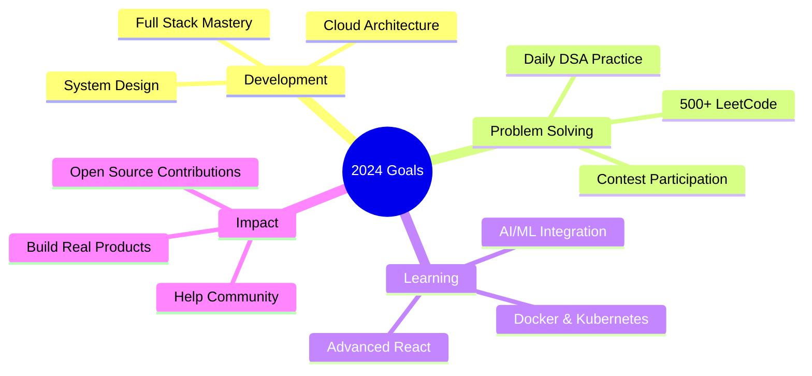

# 💫 Eeshanya Joshi

<div align="center">

[](https://git.io/typing-svg)


[](https://github.com/Code-Ph0enix)
[](https://github.com/Code-Ph0enix?tab=followers)
[](https://github.com/Code-Ph0enix)

</div>

---

## 🚀 About Me

```typescript
const eeshanya = {
    location: "Mumbai, India 🇮🇳",
    education: "KJ Somaiya College of Engineering 🎓",
    role: "Full Stack Developer | AI/ML Enthusiast",
    currentFocus: ["DSA Mastery", "System Design", "Building Scalable Products"],
    motto: "Code. Break. Fix. Repeat. 🔄",
    funFact: "I debug with console.log() and I'm not ashamed! 😅"
};
```

---

## 🛠️ Tech Stack

<div align="center">

### 💻 Languages


### 🎨 Frontend


### ⚙️ Backend & Databases


### 🔧 Tools & Platforms


### 📊 Data & Analytics


</div>

---

## 📊 GitHub Analytics

<div align="center">
  


</div>

<div align="center">
  


</div>

---

## 🏆 Achievements & Trophies

<div align="center">


</div>

---

## 💻 LeetCode Stats

<div align="center">

[](https://leetcode.com/u/Code__Phoenix/)


</div>

---

## 🎯 Current Focus & Learning Path

<div align="center">



### 📚 Learning Progress

| Technology | Progress | Status |
|------------|----------|--------|
| System Design | ████████░░ 80% | 🔥 Active |
| React Advanced | ███████░░░ 70% | 🔥 Active |
| Docker & K8s | ██████░░░░ 60% | ⚡ Learning |
| AI/ML | █████░░░░░ 50% | 🎯 Exploring |

</div>

---

## 🤝 Connect With Me

<div align="center">

[](https://www.linkedin.com/in/eeshanyajoshi)
[](mailto:eeshanyajoshi@gmail.com)
[](https://leetcode.com/u/Code__Phoenix/)
[](https://github.com/Code-Ph0enix)
[](tel:+918169570762)

</div>

---

## 💭 Random Dev Quote

<div align="center">


</div>

---

## 🐍 Contribution Snake

<div align="center">


</div>

---

<div align="center">

### 💖 Thanks for visiting my profile!


**"First, solve the problem. Then, write the code."** – John Johnson


**Last Updated:** `November 2024` | Made with ❤️ and ☕

</div>
